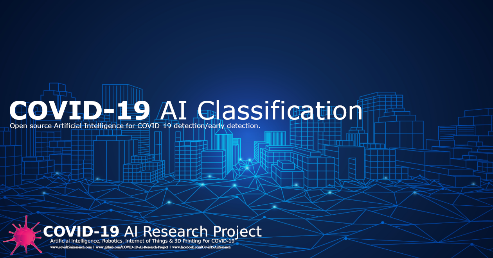

# Peter Moss COVID-19 AI Research Project

## COVID-19 AI Classification

### COVID-19 Tensorflow DenseNet Classifier

[](https://github.com/COVID-19-AI-Research-Project/xDNN)

&nbsp;

# Table Of Contents

- [Introduction](#introduction)
- [Required Hardware](#required-hardware)
- [Prerequisites](#prerequisites)
  - [Ubuntu 18.04.4 LTS](#ubuntu-server-18044-lts)
  - [Clone the repository](#clone-the-repository)
    - [Developer Forks](#developer-forks)
- [Installation](#installation)
  - [Easy Install](#easy-install)
  - [Manual Install](#manual-install)
- [Data](#data)
  - [Test Data](#test-data)
- [Continue](#continue)
- [Contributing](#contributing)
  - [Contributors](#contributors)
- [Versioning](#versioning)
- [License](#license)
- [Bugs/Issues](#bugs-issues)

&nbsp;

# Introduction

The following guide will take you through setting up and installing the [ COVID-19 Tensorflow DenseNet Classifier](https://github.com/COVID-19-AI-Research-Project/AI-Classification/tree/master/Projects/2 " COVID-19 Tensorflow DenseNet Classifier").

&nbsp;

# Prerequisites

## Ubuntu 18.04.4 LTS

For this Project, the operating system choice is [Ubuntu 18.04.4 LTS](https://releases.ubuntu.com/18.04.4/ "Ubuntu 18.04.4 LTS"). To get your operating system installed you can follow the [Create a bootable USB stick on Ubuntu](https://tutorials.ubuntu.com/tutorial/tutorial-create-a-usb-stick-on-ubuntu#0 "Create a bootable USB stick on Ubuntu") tutorial.

## Python3

Ubuntu 18.04 come with Python 3.6 by default. You should be able to invoke it with the command in Shell:

```
python3
```

## Clone the repository

Clone the [COVID-19 AI Classification](https://github.com/COVID-19-AI-Research-Project/AI-Classification " COVID-19 AI Classification") repository from the [Peter Moss COVID-19 AI Research](https://github.com/COVID-19-AI-Research-Project "Peter Moss COVID-19 AI Research") Github Organization.

To clone the repository and install the COVID-19 Tensorflow DenseNet Classifier, make sure you have Git installed. Now navigate to the home directory on your device using terminal/commandline, and then use the following command.

```
  $ git clone https://github.com/COVID-19-AI-Research-Project/AI-Classification.git
```

Once you have used the command above you will see a directory called **COVID-19-AI-Research-Project** in your home directory.

```
ls
```

Using the ls command in your home directory should show you the following.

```
COVID-19-AI-Research-Project
```

Navigate to **COVID-19-AI-Research-Project/Projects/2** directory, this is your project root directory for this tutorial.

### Developer Forks

Developers from the Github community that would like to contribute to the development of this project should first create a fork, and clone that repository. For detailed information please view the [CONTRIBUTING](../../../../CONTRIBUTING.md "CONTRIBUTING") guide. You should pull the latest code from the development branch.

```
  $ git clone -b "0.2.0" https://github.com/COVID-19-AI-Research-Project/AI-Classification.git
```

The **-b "0.2.0"** parameter ensures you get the code from the latest master branch. Before using the below command please check our latest master branch in the button at the top of the project README.

&nbsp;

# Installation

Use the following commands to install the required software:

## Easy Install

The following will install all dependencies. This installation will install Tensorflow GPU, if you need to install Tensorflow for CPU remove the **-gpu** in the shell file.

```
sh Scripts/Installation/Shell/Install.sh
```

## Manual Install

The following will install all dependencies. This installation will install Tensorflow GPU, if you need to install Tensorflow for CPU remove the **-gpu**

```
pip3 install numpy
pip3 install scipy
pip3 install scikit-image
pip3 install pandas
pip3 install scikit-learn
pip3 install matplotlib
pip3 install jsonpickle
pip3 install flask
pip3 install tensorflow-gpu==2.1.0
```

&nbsp;

# Data

Now you need to download the [SARS-COV-2 Ct-Scan Dataset](https://www.kaggle.com/plameneduardo/sarscov2-ctscan-dataset "SARS-COV-2 Ct-Scan Dataset"). Once you have downloaded the data you need to add the negative samples to the **Model/Data/0/** directory, and the positive samples to the **Model/Data/1/** directory.

## Test Data

In the project configuration file you will find **data->test_0** and **data->test_1**. The files provided will allow you to use the same test data for your real-world testing when using the local classifier and the HTTP classifier.

These files are skipped during the augmentation process and used when using the local and HTTP classifier. You will also use them in the HIAS UI by sending them to the server for classification.

```
{
    "device": {
        "ip": "",
        "sever": {
            "port": 8181
        }
    },
    "modes": [
        "Classify",
        "Client",
        "Server",
        "Train"
    ],
    "data": {
        "allowed": [
            ".png"
        ],
        "batch": 64,
        "channels": 3,
        "dim": 64,
        "h5": "Model/model.h5",
        "rotations": 1,
        "seed": 42,
        "test_size": 0.255,
        "test_0": [
            "Model/Data/0/Non-Covid (1).png",
            "Model/Data/0/Non-Covid (54).png",
            "Model/Data/0/Non-Covid (104).png",
            "Model/Data/0/Non-Covid (389).png",
            "Model/Data/0/Non-Covid (582).png"
        ],
        "test_1": [
            "Model/Data/1/Covid (10).png",
            "Model/Data/1/Covid (76).png",
            "Model/Data/1/Covid (156).png",
            "Model/Data/1/Covid (356).png",
            "Model/Data/1/Covid (675).png"
        ],
        "threshold": 0.5,
        "train": "Model/Data"
    },
    "model": {
        "beta_1": 0.9,
        "beta_2": 0.999,
        "decay": 0.0,
        "dropout": 0.5,
        "epochs": 50,
        "epsilon": 0.1,
        "factor": 0.5,
        "json": "Model/model.json",
        "lr": 0.002,
        "min_lr": 1e-3,
        "patience": 5,
        "weights": "Model/model.h5"
    },
    "iotJumpWay": {
        "loc": 0,
        "zne": 0,
        "id": 0,
        "name": "",
        "mqtt": {
            "username": "",
            "password": ""
        }
    }
}
```

&nbsp;

# Continue

Now continue with the [COVID-19 DenseNet](../../Projects/2/ "COVID-19 DenseNet") tutorial.

&nbsp;

# Contributing

Peter Moss COVID-19 AI Research Project encourages and welcomes code contributions, bug fixes and enhancements from the Github.

Please read the [CONTRIBUTING](../../../../CONTRIBUTING.md "CONTRIBUTING") document for a full guide to forking your repositories and submitting your pull requests. You will also find information about your code of conduct on this page.

## Contributors

- [Adam Milton-Barker](https://www.leukemiaresearchassociation.ai/team/adam-milton-barker "Adam Milton-Barker") - [Peter Moss Leukemia AI Research](https://www.leukemiaresearchassociation.ai "Peter Moss Leukemia AI Research") Founder & Intel Software Innovator, Sabadell, Spain

&nbsp;

# Versioning

You use SemVer for versioning. For the versions available, see [Releases](../../../../releases "Releases").

&nbsp;

# License

This project is licensed under the **MIT License** - see the [LICENSE](../../../../LICENSE "LICENSE") file for details.

&nbsp;

# Bugs/Issues

You use the [repo issues](../../../../issues "repo issues") to track bugs and general requests related to using this project. See [CONTRIBUTING](../../../../CONTRIBUTING.md "CONTRIBUTING") for more info on how to submit bugs, feature requests and proposals.
